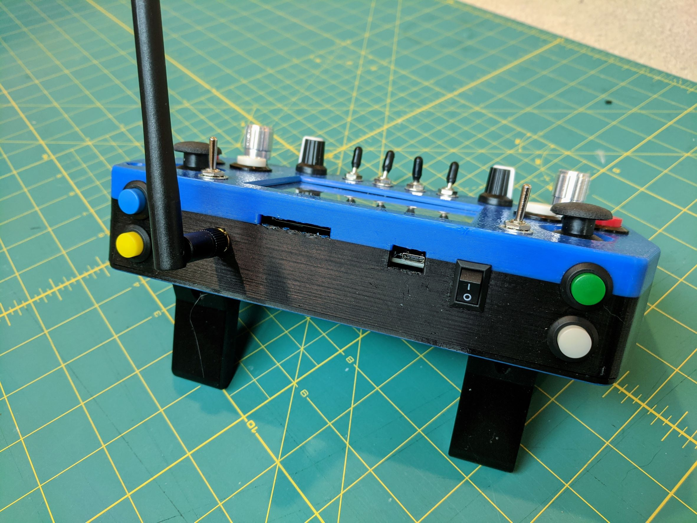
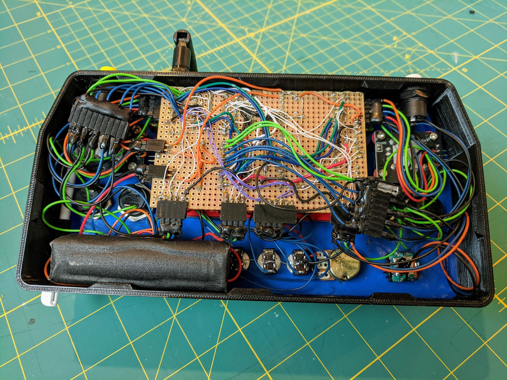
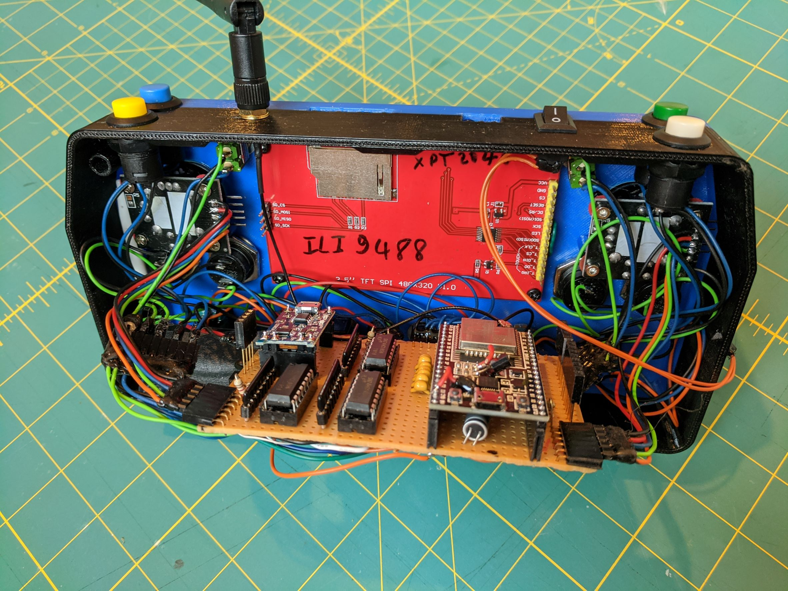
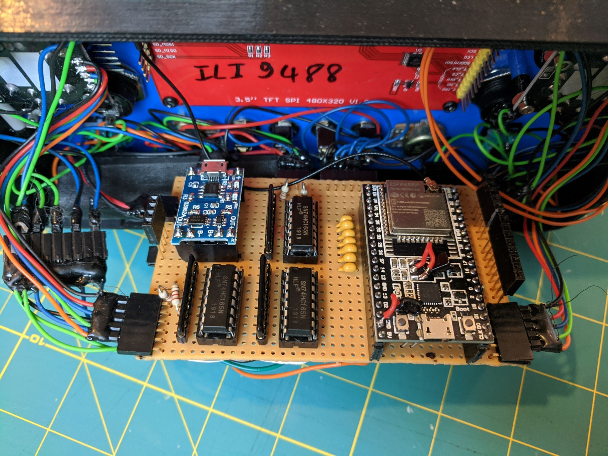

<!-- PROJECT LOGO -->
<br />
<div align="center">
  <a href="https://github.com/avenhaus/ESP32_ROS_Robot_Remote">
    
  </a>

<h3 align="center">ESP32 ROS Robot Remote</h3>

  <p align="center">
    This is a universal Robot-OS (ROS) remote control based on an ESP32 microcontroller. 
  </p>
</div>

<!-- ABOUT THE PROJECT -->
## About The Project


### Project State
This is still a work in progress. Basic functionality like publishing all the controls to a ROS1 topic is working.

### Features

* ESP32 connecting to ROS via WIFI
* 3.5" Touch LCD 480 x 320
* 2 x analog X/Y gamepad joysticks with push switch
* 2 x analog potentiometer
* 2 x rotary encoder with push switch (KY-040)
* 4 x 2-position toggle switches
* 2 x 3-position toggle switches
* 8 x push buttons
* 18650 Li-Ion battery
* External WIFI antenna for better range
* SD-card reader
* Integrated stylus holder
* Optional feet
* Quick startup time
* OTA update
* Low cost

## Configuration

### ROS Topics

```
> rostopic info remote_joy
Type: sensor_msgs/Joy

> rostopic echo remote_joy

header: 
  seq: 211
  stamp: 
    secs: 50
    nsecs: 497000000
  frame_id: "remote"
axes: [-0.011300298385322094, -0.011915299110114574, 0.0, 0.1590232104063034, -0.011768353171646595, -0.011577111668884754, 0.0, 0.754769504070282]
buttons: [0, 0, 0, 0, 0, 0, 0, 0, 0, 0, 0, 0, 0, 0, 0, 0, 0, 0, 0, 0]

```

## TODO
* Code for Display 
* Web Configuration
* Build instructions
* ROS-2 support
* PCB

## Images






## Links
* [ROS - Robot Operating System](https://www.ros.org/)

## Credits
Inspired by James Bruton [Touchscreen Smart Robot Remote](https://www.youtube.com/watch?v=ATQblGOjMWQ)
<p align="right">(<a href="#top">back to top</a>)</p>